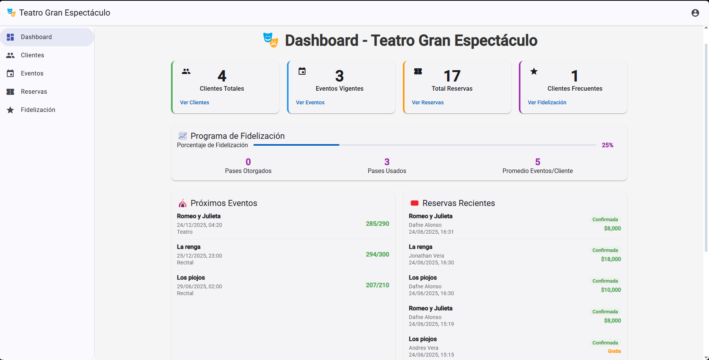
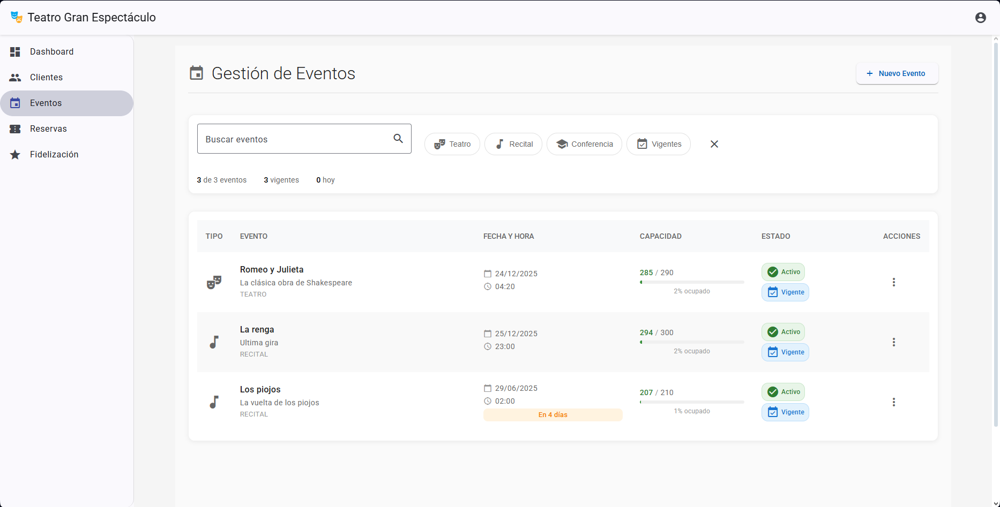
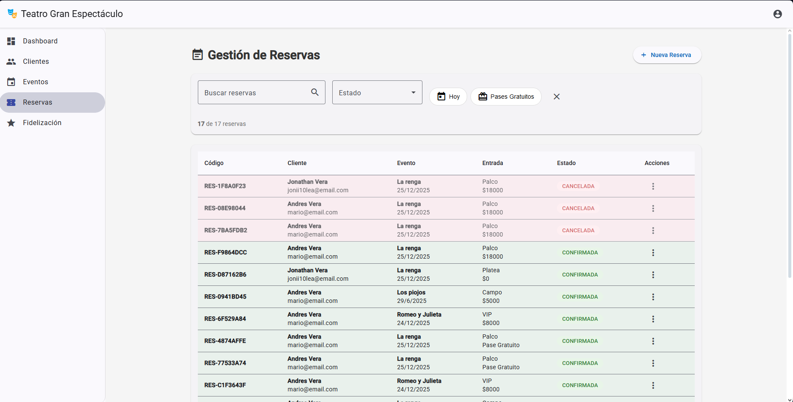
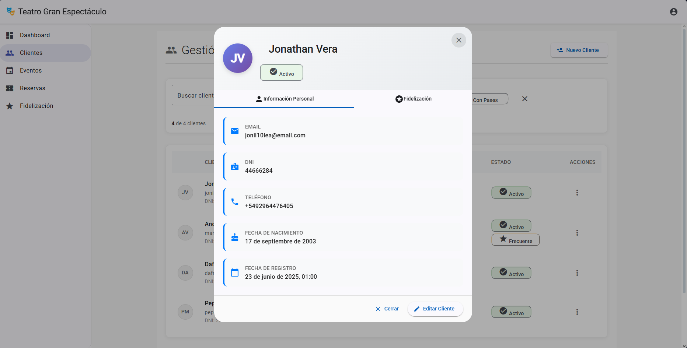

# 🎭 Sistema Teatro Gran Espectáculo - Frontend

Aplicación web moderna desarrollada con **Angular 16+** y **Material Design** para la gestión completa del Teatro Gran Espectáculo.

## 📋 Descripción

Frontend del sistema de gestión teatral que proporciona una interfaz intuitiva y moderna para administrar eventos, reservas, clientes y el programa de fidelización.

## ✨ Características de la Aplicación

### 🏠 Dashboard Ejecutivo
- **Métricas en tiempo real** de eventos y ventas
- **Gráficos interactivos** de estadísticas
- **Panel de control** con indicadores clave
- **Resumen de actividad** reciente

### 🎪 Gestión de Eventos
- **Lista completa** de eventos con filtros avanzados
- **Creación de eventos** con wizard paso a paso
- **Gestión de capacidades** por tipo de entrada
- **Control de disponibilidad** en tiempo real

### 👥 Administración de Clientes
- **Base de datos completa** de clientes
- **Búsqueda avanzada** por múltiples criterios
- **Perfil detallado** con historial de reservas
- **Gestión del programa de fidelización**

### 🎫 Sistema de Reservas
- **Proceso de reserva** intuitivo y guiado
- **Validación en tiempo real** de disponibilidad
- **Gestión de estados** (confirmada/cancelada)
- **Generación automática** de códigos de reserva

### 🎁 Programa de Fidelización
- **Dashboard de fidelización** con estadísticas
- **Tracking visual** de progreso del cliente
- **Gestión de pases gratuitos**
- **Reportes de clientes frecuentes**

## 🛠️ Tecnologías Utilizadas

- **Angular 16+**
- **Angular Material UI**
- **TypeScript**
- **RxJS** para programación reactiva
- **Angular Router** para navegación
- **Angular Forms** (Reactive Forms)
- **Chart.js** para gráficos
- **Angular CDK** para componentes avanzados

## 🚀 Instalación y Configuración

### Prerrequisitos
- Node.js 16 o superior
- npm 8+ o yarn
- Angular CLI 16+
- Git

### 1. Clonar el Repositorio
```bash
git clone [URL_DEL_REPOSITORIO_FRONTEND]
cd teatro-frontend
```

### 2. Instalar Dependencias
```bash
# Con npm
npm install

# O con yarn
yarn install
```

### 3. Configurar Conexión con Backend

La conexión con el backend está configurada directamente en los services. La URL base se define en cada service:

```typescript
// src/app/services/cliente.service.ts
@Injectable({
  providedIn: 'root'
})
export class ClienteService {
  private apiUrl = 'http://localhost:8080/api/clientes';
  
  constructor(private http: HttpClient) { }
  
  // Métodos del service...
}
```

**Si necesitas cambiar la URL del backend**, actualiza la variable `apiUrl` en cada service:
- `src/app/services/cliente.service.ts`
- `src/app/services/evento.service.ts`
- `src/app/services/reserva.service.ts`
- `src/app/services/fidelizacion.service.ts`

### 4. Configurar Proxy (Opcional)

Si prefieres usar un proxy en lugar de URLs directas, crear `proxy.conf.json` en la raíz:
```json
{
  "/api/*": {
    "target": "http://localhost:8080",
    "secure": true,
    "changeOrigin": true,
    "logLevel": "debug"
  }
}
```

### 5. Ejecutar la Aplicación

```bash
# Desarrollo normal
ng serve

# Con proxy configurado
ng serve --proxy-config proxy.conf.json

# En puerto específico
ng serve --port 4200
```

La aplicación estará disponible en: `http://localhost:4200`

## 🏗️ Estructura del Proyecto

```
src/
├── app/
│   ├── components/           # Componentes reutilizables
│   │   ├── dashboard/
│   │   ├── eventos/
│   │   ├── clientes/
│   │   ├── reservas/
│   │   └── fidelizacion/
│   ├── services/            # Servicios para API
│   │   ├── evento.service.ts
│   │   ├── cliente.service.ts
│   │   ├── reserva.service.ts
│   │   └── fidelizacion.service.ts
│   ├── models/              # Interfaces y DTOs
│   │   ├── evento.model.ts
│   │   ├── cliente.model.ts
│   │   └── reserva.model.ts
│   ├── guards/              # Guards de navegación
│   ├── interceptors/        # Interceptors HTTP
│   └── shared/              # Módulos compartidos
├── assets/                  # Recursos estáticos
├── environments/            # Configuraciones de entorno
└── styles/                  # Estilos globales
```

## 🎨 Componentes Principales

### 📊 Dashboard Component
- **Vista general** del sistema
- **Métricas principales** en cards
- **Gráficos** de eventos más populares
- **Lista de actividad** reciente

### 🎭 Eventos Component
- **Lista paginada** con filtros
- **Modal de detalles** del evento
- **Formulario de creación/edición**
- **Gestión de disponibilidad**

### 👤 Clientes Component
- **Tabla completa** con búsqueda
- **Perfil detallado** del cliente
- **Historial de reservas**
- **Indicadores de fidelización**

### 🎟️ Reservas Component
- **Wizard de nueva reserva**
- **Lista con filtros avanzados**
- **Gestión de estados**
- **Impresión de comprobantes**

## 🧪 Testing

```bash
# Tests unitarios
ng test

# Tests e2e
ng e2e

# Coverage
ng test --code-coverage
```

## 📱 Características de UI/UX

### 🎨 Design System
- **Material Design 3** como base
- **Tema personalizado** del teatro
- **Componentes consistentes**
- **Iconografía teatral**

### ♿ Accesibilidad
- **ARIA labels** completos
- **Navegación por teclado**
- **Contraste adecuado**
- **Screen reader** compatible

## 📦 Dependencias Principales

```json
{
  "@angular/core": "^16.0.0",
  "@angular/material": "^16.0.0",
  "@angular/cdk": "^16.0.0",
  "chart.js": "^4.0.0",
  "ng2-charts": "^5.0.0",
  "rxjs": "^7.8.0",
  "moment": "^2.29.0"
}
```

## 🌟 Funcionalidades Destacadas

### ✅ Experiencia de Usuario
- **Wizard guiado** para crear reservas
- **Búsqueda en tiempo real** de clientes
- **Filtros avanzados** en todas las listas
- **Feedback visual** para todas las acciones

### ✅ Performance
- **Lazy loading** de módulos
- **OnPush** change detection
- **Virtual scrolling** para listas grandes
- **Caching** de datos frecuentes

### ✅ Manejo de Estados
- **RxJS** para estado reactivo
- **Services** centralizados
- **Error handling** global
- **Loading states** consistentes

## 📸 Capturas de Pantalla

### Dashboard Principal


### Gestión de Eventos


### Sistema de Reservas


### Perfil de Cliente


## 👨‍💻 Autor

**Jonathan Vera**
- Email: jonii10lea@gmail.com
- LinkedIn: [www.linkedin.com/in/jonathan-vera-0b9784241]

---

**¡Interfaz moderna y funcional para el Teatro Gran Espectáculo! 🎭✨**
